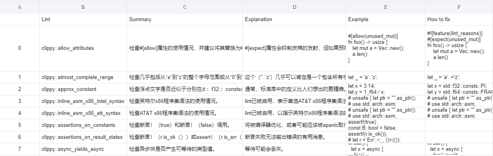

# lint-info-extractor
Extract information about every rust lints

I don't know why... But apparently someone needs this.

## Description

Automatically pulls rust source code, and extract every lint information (including rustc and clippy lints). Then translate their summary as required, and output the result in excel format.



## Requirement

1. required python packages:

    - mistune (for converting markdown to html)

    - beautifulsoup (for parsing converted html)

    - translate-api (for translating English into other languages)

    - pandas, openpyxl (for exporting result as excel sheet)
    
        ```bash
        pip install mistune, beautifulsoup4, translators, pandas, openpyxl
        ```

    - **Optional** Jinja2 (for excel sheet styling)

        ```bash
        pip install jinja2
        ```

## Usage

```bash
python3 run.py
```

check `python3 run.py --help` for more usage
